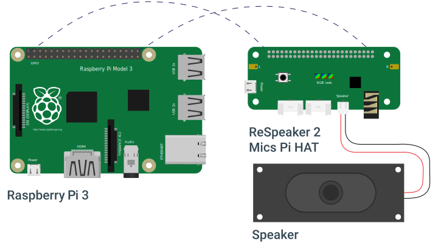
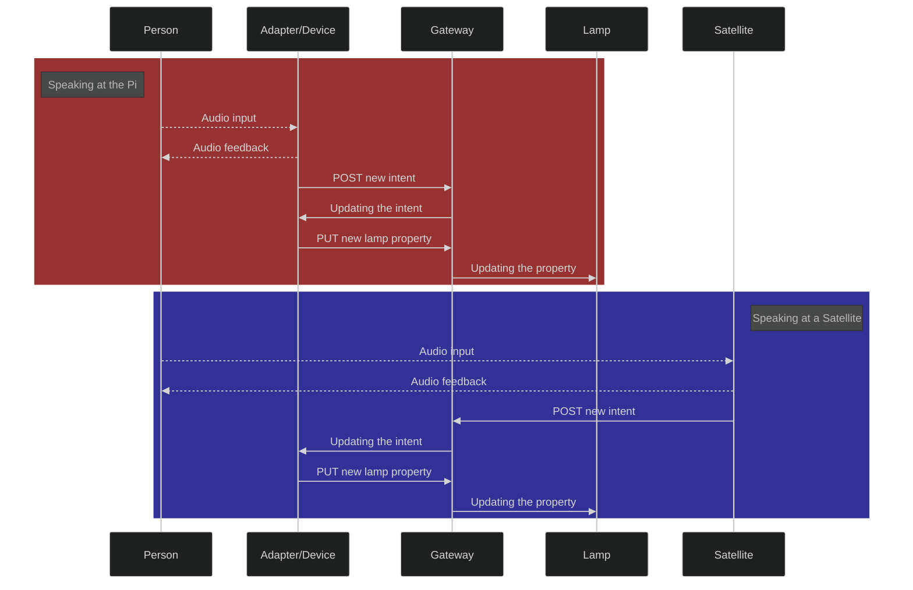

#  Avocet (ˈavəˌset)

Lightweight, local and polyglot voice assistant for the WebThings Gateway.
Built around PicoVoice and the Respeaker 2-MIC hat.

> :warning: **Warning**
> This software is still in an early stage of development, some bugs are expected.
> If you want to try it, download the latest release, unpack and restart the gateway service
> ```
> cd /home/pi/.webthings/addons/
> wget https://github.com/Bleznudd/avocet/releases/download/v0.1/avocet-0.1.tgz
> tar -xf avocet-0.1.tgz
> mv package avocet
> sudo systemctl restart webthings-gateway.service
> ```
> then enable it from the extensions page

## Functionality Overview

- [x] Turn on and off devices
- [x] Set values in level-like properties
- [ ] Lower and upper level-like properties
- [x] Set color in light devices
- [ ] Set temperature in light devices
- [x] Set enum properties
- [x] Perform actions on devices (e.g.: locks, [scene](https://github.com/WebThingsIO/scene-control-adapter) activation)
- [x] Get values from devices
- [x] Voice feedback
- [ ] ~~Set timers~~
- [x] Conversational treats (e.g.: telling a joke)

### Naming convention

Picovoice can't handle unseen words. This means that it cannot turn on your _custom-named_ device.
To use this adapter you will need to name things in a logic way, using a combination of the `locations` and `things` you can find in the [English yaml](./resources/languages/en/english.yml) file. (`things` alone are also ok)

| Good Examples           | Bad Examples           |
|-------------------------|------------------------|
| kitchen light           | Jhon's led strip       |
| front door              | PhilipsHue-a8f6ah3     |
| bedroom window          | Olly the oven          |
| radio                   |                        |
| dishwasher              |                        |

There are currently available +50 device names and +20 locations, for +1000 possible combinations

#### Customization

Since all the intents, things, properties and actions are defined in one single [yaml](./resources/languages/en/english.yml), customization is trivial.
Upon editing the file with your custom phrase, you can upload it on the [picovoice console](https://console.picovoice.ai/) and train a new model. The obtained file needs to be unpacked and copied to replace the original one

### Available languages

As of July 2022, Picovoice is available 8 languages:

- English <sup>1</sup>
- Italian <sup>1</sup>
- French <sup>2</sup>
- German <sup>3</sup>
- Spanish <sup>3</sup>
- Portuguese <sup>3</sup>
- Japanese <sup>4</sup>
- Korean <sup>4</sup>

<small>

<sup>1</sup> Avocet fully support this language <br>
<sup>2</sup> Avocet has the language available as a demo with limited functionality <br>
<sup>3</sup> Avocet has no valid translation yet, not even for a demo <br>
<sup>4</sup> Avocet may not work with this language <br>

</small>

to add or enhance a language, [English maps](./resources/languages/en/maps) and [English intent yaml](./resources/languages/en/english.yml) files needs to be translated, then used as a training base to get the model, that can later be added to the project.


> **NOTE:**
> I do not know this languages (apart from Italian and English) and thus I cannot implement them by myself. If you feel like you could be a translator, open an issue to discuss this opportunity, or even better a PR

## Hardware support




This adapter has been tested using the [Respeaker 2-MICs HAT](https://wiki.seeedstudio.com/ReSpeaker_2_Mics_Pi_HAT/). It _could_ be compatible with a USB conference microphone/speaker combo, but I do not have one to test it, and I'm not interested in adding support for it. Still, if you do, feel free to open a PR.

## Architecture

The way the intent is processed and send through the components is meant to simplify the work of a satellite microphone/speaker.

In fact the `main-voice-assistant-device` is the virtual one, represented by the Pi itself. For this virtual device to perform actions on to other devices, we need to send a POST request for a `new-intent` action with a valid JSON. The intention is then processed to find the corresponding device and property, and a PUT request is sent, to update the final value.

In other words that the thread (or device) that listen for the audio input sends the intent to the gateway, asking to perform an action on the virtual device, and this triggers it to send another request (again on the gateway), this time to update the final device.

A Satellite should thus implement the voice to intent mechanism, and be able to send it through HTTP, while the remaining work will still be done by the Pi.



> **NOTE:**
> There is still no satellite code available yet. If you write some, please open a PR to add a link to your repository here

## Why Picovoice?

<u>Picovoice is **not** FOSS.</u> If this bothers you, I understand, and it's the reason why I'm planning to switch to something else. The sad truth though is that Picovoice is dead simple to use and can run on everything, even some arduino boards (perfect for satellites), while still being an offline solution.
It will probably stay until all the actions I need are implemented, to give me (and you) a working prototype. At that point, I hope there will be some fully open source and fast enough solutions to switch to.

---

<!-- **Special thanks** to [@mrstegeman](https://github.com/WebThingsIO/eufy-adapter/commits?author=mrstegeman) for it's work on the [simpliest python adapter I could find](https://github.com/WebThingsIO/eufy-adapter) and to [@createcandle](https://github.com/createcandle/voco/commits?author=createcandle) for the inspirational [voice assistant](https://github.com/createcandle/voco) -->

